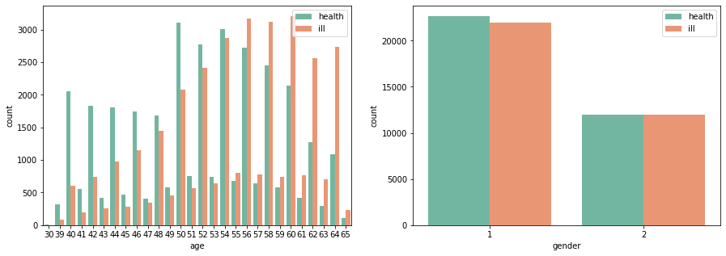

本案例基于Kaggle公开的[心血管患者诊断数据](https://www.kaggle.com/sulianova/cardiovascular-disease-dataset) ，从患者生理指标、医疗检测指标和患者提供的主观信息出发，使用机器学习中的集成方法对患者是否患心血管疾病进行预测分析。首先我们对数据进行预处理和探索性分析，挖掘出数据的内在联系；然后借助sklearn中的分类模型进行预测；最后比较不同分类器下的预测效果。

# 目录
1. [数据说明与预处理](#1.数据说明与预处理)<br> 
&emsp;&emsp;1.1 [数据说明](#1.1)<br> 
&emsp;&emsp;1.2 [剔除异常数据](#1.2)<br>
2. [探索性分析](#2.探索性分析)  
&emsp;&emsp;2.1 [特征的分布情况](#2.1)<br> 
&emsp;&emsp;2.2 [BMI指标的计算和分析](#2.2)<br>
&emsp;&emsp;2.3 [血压情况的计算和分析](#2.3)<br>
&emsp;&emsp;2.4 [特征间的相关性](#2.4)<br>
3. [分类建模](#3.分类建模)   
&emsp;&emsp;3.1 [逻辑回归](#3.1)<br>
&emsp;&emsp;3.2 [随机森林](#3.2)<br>
&emsp;&emsp;3.3 [GBDT](#3.3)<br>
&emsp;&emsp;3.4 [特征重要性](#3.4)<br>
4. [总结](#4.总结)

心血管疾病(cardiovascular disease，简称CVD)是指心脏和血管疾病的总称，常见的心血管疾病包括：高血压(血压升高)、冠心病(心脏病发作)、脑血管疾病(中风)、周围血管疾病、心力衰竭、风湿性心脏病、先天性心脏病和心肌病等。心血管疾病是全球的头号死因：每年死于心血管疾病的人数多于其它任何病因。据世界卫生组织报道，在2012年约有1750万人死于心血管疾病，占全球死亡总数的31％。这些死者中，估计740万人死于冠心病，670万人死于中风；由于心血管疾病患者不断增加，心血管疾病的诊断与治疗成为医疗行业的一大重要问题。<br><br>
四分之三以上的心血管疾病死亡发生在低收入和中等收入国家，大量烟草使用、不健康饮食和肥胖、缺乏运动和过度摄入酒精等危险因素而引发。早期检查对于预防心血管疾病，如心肌梗死、中风、主动脉瘤破裂等十分重要。心血管疾病的常规检查包括血压检查(收缩压、舒张压等)、血脂检查(甘油三酯、胆固醇等)、体重指数、体脂率等，将患者的医疗检测数据与预测算法相结合，将有助于医生正确评估风险，更好地制定预防性治疗及患者生活方式的改变。

# 1.数据说明与预处理

## 1.1 数据说明
本案例使用了Kaggele公开的心血管疾病患者诊断数据，基于患者的生理指标(性别、年龄、体重、身高等)、医疗检测指标(血压、血糖、胆固醇水平等)和患者提供的主观信息(吸烟、饮酒、运动等)共计12个特征，对患病情况进行分析。数据共计70000条，其中心血管疾病患者人数为34979，未患病人数为35021，各数据指标含义如下表所示：

|特征来源|列名|含义说明|
|:-:|:-:|:-:|
|患者编号|id||
|生理指标|age|患者年龄，单位`天(day)`|
|生理指标|height|患者身高，单位`cm`|
|生理指标|weight|患者体重，单位`kg`|
|生理指标|gender|患者性别，`1`为女性，`2`为男性|
|医疗指标|ap_hi|收缩压(心脏收缩时的动脉血压最高值)|
|医疗指标|ap_lo|舒张压(心脏舒张时的动脉血压最低值)|
|医疗指标|cholesterol|胆固醇水平，`1`为正常, `2`为超出正常水平, `3`为大量超出正常水平|
|医疗指标|gluc|血糖浓度(血液中的葡萄糖含量)，`1`为正常, `2`为超出正常水平, `3`为大量超出正常水平|
|主观信息|smoke|患者是否经常吸烟，`1`代表经常吸烟，`0`代表不经常吸烟|
|主观信息|alco|患者是否经常饮酒，`1`代表经常饮酒，`0`代表不经常饮酒|
|主观信息|active|患者是否经常运动，`1`代表经常运动，`0`代表不经常运动|
|患病情况|cardio|当患有心血管疾病时，目标类别`cardio`为1，否则`cardio`为0|


首先，我们载入需要使用的模块和读入相关数据。


```python
import pandas as pd
import numpy as np
import matplotlib.pyplot as plt
import seaborn as sns

data = pd.read_csv("cardio_train.csv")
data.head()
```


<div>
<style scoped>
    .dataframe tbody tr th:only-of-type {
        vertical-align: middle;
    }

    .dataframe tbody tr th {
        vertical-align: top;
    }

    .dataframe thead th {
        text-align: right;
    }
</style>
<table border="1" class="dataframe">
  <thead>
    <tr style="text-align: right;">
      <th></th>
      <th>id</th>
      <th>age</th>
      <th>gender</th>
      <th>height</th>
      <th>weight</th>
      <th>ap_hi</th>
      <th>ap_lo</th>
      <th>cholesterol</th>
      <th>gluc</th>
      <th>smoke</th>
      <th>alco</th>
      <th>active</th>
      <th>cardio</th>
    </tr>
  </thead>
  <tbody>
    <tr>
      <th>0</th>
      <td>0</td>
      <td>18393</td>
      <td>2</td>
      <td>168</td>
      <td>62.0</td>
      <td>110</td>
      <td>80</td>
      <td>1</td>
      <td>1</td>
      <td>0</td>
      <td>0</td>
      <td>1</td>
      <td>0</td>
    </tr>
    <tr>
      <th>1</th>
      <td>1</td>
      <td>20228</td>
      <td>1</td>
      <td>156</td>
      <td>85.0</td>
      <td>140</td>
      <td>90</td>
      <td>3</td>
      <td>1</td>
      <td>0</td>
      <td>0</td>
      <td>1</td>
      <td>1</td>
    </tr>
    <tr>
      <th>2</th>
      <td>2</td>
      <td>18857</td>
      <td>1</td>
      <td>165</td>
      <td>64.0</td>
      <td>130</td>
      <td>70</td>
      <td>3</td>
      <td>1</td>
      <td>0</td>
      <td>0</td>
      <td>0</td>
      <td>1</td>
    </tr>
    <tr>
      <th>3</th>
      <td>3</td>
      <td>17623</td>
      <td>2</td>
      <td>169</td>
      <td>82.0</td>
      <td>150</td>
      <td>100</td>
      <td>1</td>
      <td>1</td>
      <td>0</td>
      <td>0</td>
      <td>1</td>
      <td>1</td>
    </tr>
    <tr>
      <th>4</th>
      <td>4</td>
      <td>17474</td>
      <td>1</td>
      <td>156</td>
      <td>56.0</td>
      <td>100</td>
      <td>60</td>
      <td>1</td>
      <td>1</td>
      <td>0</td>
      <td>0</td>
      <td>0</td>
      <td>0</td>
    </tr>
  </tbody>
</table>
</div>


```python
data.info()
```

    <class 'pandas.core.frame.DataFrame'>
    RangeIndex: 70000 entries, 0 to 69999
    Data columns (total 13 columns):
    id             70000 non-null int64
    age            70000 non-null int64
    gender         70000 non-null int64
    height         70000 non-null int64
    weight         70000 non-null float64
    ap_hi          70000 non-null int64
    ap_lo          70000 non-null int64
    cholesterol    70000 non-null int64
    gluc           70000 non-null int64
    smoke          70000 non-null int64
    alco           70000 non-null int64
    active         70000 non-null int64
    cardio         70000 non-null int64
    dtypes: float64(1), int64(12)
    memory usage: 6.9 MB


可以看到：所有特征字段均为数字类型，12个整数型和1个浮点小数型，同时每个特征字段均不存在缺失值。接下来我们使用描述性统计函数观察一下各特征的数值分布。


```python
data.describe(include='all')
```


<div>
<style scoped>
    .dataframe tbody tr th:only-of-type {
        vertical-align: middle;
    }

    .dataframe tbody tr th {
        vertical-align: top;
    }

    .dataframe thead th {
        text-align: right;
    }
</style>
<table border="1" class="dataframe">
  <thead>
    <tr style="text-align: right;">
      <th></th>
      <th>id</th>
      <th>age</th>
      <th>gender</th>
      <th>height</th>
      <th>weight</th>
      <th>ap_hi</th>
      <th>ap_lo</th>
      <th>cholesterol</th>
      <th>gluc</th>
      <th>smoke</th>
      <th>alco</th>
      <th>active</th>
      <th>cardio</th>
    </tr>
  </thead>
  <tbody>
    <tr>
      <th>count</th>
      <td>70000.000000</td>
      <td>70000.000000</td>
      <td>70000.000000</td>
      <td>70000.000000</td>
      <td>70000.000000</td>
      <td>70000.000000</td>
      <td>70000.000000</td>
      <td>70000.000000</td>
      <td>70000.000000</td>
      <td>70000.000000</td>
      <td>70000.000000</td>
      <td>70000.000000</td>
      <td>70000.000000</td>
    </tr>
    <tr>
      <th>mean</th>
      <td>49972.419900</td>
      <td>19468.865814</td>
      <td>1.349571</td>
      <td>164.359229</td>
      <td>74.205690</td>
      <td>128.817286</td>
      <td>96.630414</td>
      <td>1.366871</td>
      <td>1.226457</td>
      <td>0.088129</td>
      <td>0.053771</td>
      <td>0.803729</td>
      <td>0.499700</td>
    </tr>
    <tr>
      <th>std</th>
      <td>28851.302323</td>
      <td>2467.251667</td>
      <td>0.476838</td>
      <td>8.210126</td>
      <td>14.395757</td>
      <td>154.011419</td>
      <td>188.472530</td>
      <td>0.680250</td>
      <td>0.572270</td>
      <td>0.283484</td>
      <td>0.225568</td>
      <td>0.397179</td>
      <td>0.500003</td>
    </tr>
    <tr>
      <th>min</th>
      <td>0.000000</td>
      <td>10798.000000</td>
      <td>1.000000</td>
      <td>55.000000</td>
      <td>10.000000</td>
      <td>-150.000000</td>
      <td>-70.000000</td>
      <td>1.000000</td>
      <td>1.000000</td>
      <td>0.000000</td>
      <td>0.000000</td>
      <td>0.000000</td>
      <td>0.000000</td>
    </tr>
    <tr>
      <th>25%</th>
      <td>25006.750000</td>
      <td>17664.000000</td>
      <td>1.000000</td>
      <td>159.000000</td>
      <td>65.000000</td>
      <td>120.000000</td>
      <td>80.000000</td>
      <td>1.000000</td>
      <td>1.000000</td>
      <td>0.000000</td>
      <td>0.000000</td>
      <td>1.000000</td>
      <td>0.000000</td>
    </tr>
    <tr>
      <th>50%</th>
      <td>50001.500000</td>
      <td>19703.000000</td>
      <td>1.000000</td>
      <td>165.000000</td>
      <td>72.000000</td>
      <td>120.000000</td>
      <td>80.000000</td>
      <td>1.000000</td>
      <td>1.000000</td>
      <td>0.000000</td>
      <td>0.000000</td>
      <td>1.000000</td>
      <td>0.000000</td>
    </tr>
    <tr>
      <th>75%</th>
      <td>74889.250000</td>
      <td>21327.000000</td>
      <td>2.000000</td>
      <td>170.000000</td>
      <td>82.000000</td>
      <td>140.000000</td>
      <td>90.000000</td>
      <td>2.000000</td>
      <td>1.000000</td>
      <td>0.000000</td>
      <td>0.000000</td>
      <td>1.000000</td>
      <td>1.000000</td>
    </tr>
    <tr>
      <th>max</th>
      <td>99999.000000</td>
      <td>23713.000000</td>
      <td>2.000000</td>
      <td>250.000000</td>
      <td>200.000000</td>
      <td>16020.000000</td>
      <td>11000.000000</td>
      <td>3.000000</td>
      <td>3.000000</td>
      <td>1.000000</td>
      <td>1.000000</td>
      <td>1.000000</td>
      <td>1.000000</td>
    </tr>
  </tbody>
</table>
</div>


可以看到：
+ 由于数据中的年龄`age`用`天`为单位进行表示，不太方便我们的分析与观察，之后我们需要将年龄单位转换为`年`。
+ 身高`height`、体重`weight`数值分布可能存在异常，如最小身高为55cm，最低体重为10kg。
+ 收缩压`ap_hi`和舒张压`ap_lo`存在明显异常，最小值均为负数且最大值分别为16020和11000。

## 1.2 剔除异常数据
首先我们将年龄的单位转换为`年`，并进行四舍五入保留整数。


```python
data['age'] = round(data['age']/365).astype(int)
```


```python
fig = plt.figure(figsize = (6,4))

plt.hist(data['age'],bins=15) 
plt.title("age distribution")
plt.show()
```


可以看到，年龄的变化区间为30-65岁，根据生活常识，判定身高和体重列的数值存在异常，我们将身高限定为>=140cm，体重>=40kg，从数据中剔除异常数据。


```python
data = data[(data['height']>=140)&(data['weight']>=40)]
data.shape
```


    (69802, 13)


可以看到，通过身高和体重的限定，我们剔除了192个异常数据，接下来我们需要处理血压的异常数据。<br><br>
血压的单位为千帕，1千帕=7.6mmHg，成人正常的收缩压为90~130mmHg，正常的舒张压为60~90mmHg，也就是人们常说的60至90。根据世界卫生组织规定，成人收缩压≥140mmHg(21.3kPa)时即可确诊为高血压；收缩压<130mmHg(18.6kPa)称为正常血压；介于二者之间者，称为临界高血压；收缩压<90mmHg则可确诊为低血压。如下所示：

+ 低血压：收缩压<90
+ 正常血压：90<=收缩压<130
+ 临界高血压：130<=收缩压<140
+ 高血压：140<=收缩压

考虑到高低血压的变化范围，我们将收缩压`ap_hi`变化区间限定为[60,250]，将舒张压`ap_lo`的变化区间限定为[30,180]。


```python
data = data[(60<=data['ap_hi'])&(data['ap_hi']<=250)&(30<=data['ap_lo'])&(data['ap_lo']<=180)]
data.shape
```


    (68587, 13)


可以看到，通过血压变化的限定，我们又剔除了1215个异常数据。


# 2.探索性分析
<br>由于数据特征较多，我们需要探究一下各特征之间的关系，这将有助于后面建立合理有效的模型。从以下几个方面进行入手：

+ 采用直方图和核密度曲线观察各个特征的分布情况；
+ 使用分组箱线图和分组条形图分析患病与各个特征之间的关系；
+ 使用特征的相关系数图分析各个特征之间的相关性；

## 2.1 特征的分布情况
首先我们使用直方图观察4个离散型取值特征(年龄`age`,性别`gender`,胆固醇水平`cholesterol`,血糖浓度`gluc`)的分布情况。


```python
col = data.columns[[1,2,7,8]].tolist()
fig,ax = plt.subplots(2,2,figsize = (15,7))

for i in range(0,len(col)):
    plt.subplot("22"+str(i+1))
    plt.hist(data[col[i]])
    plt.xlabel(col[i],fontsize = 13)
    plt.ylabel("Count",fontsize = 13)  
plt.tight_layout()
plt.show()   
```


可以看到在整体数据集中，女性人数约为男性的两倍，大部分人的胆固醇水平和血糖浓度均处于正常水平。接下来我们使用核密度曲线观察连续性特征的数值分布情况。


```python
col = data.columns[[3,4,5,6]].tolist()
fig,ax = plt.subplots(2,2,figsize = (15,7))
for i in range(0,len(col)):
    plt.subplot('22'+str(i+1))
    x = data[col[i]]
    sns.distplot(x,color = 'lightpink') 
plt.tight_layout()
plt.show()   
```

    /anaconda3/lib/python3.7/site-packages/scipy/stats/stats.py:1713: FutureWarning: Using a non-tuple sequence for multidimensional indexing is deprecated; use `arr[tuple(seq)]` instead of `arr[seq]`. In the future this will be interpreted as an array index, `arr[np.array(seq)]`, which will result either in an error or a different result.
      return np.add.reduce(sorted[indexer] * weights, axis=axis) / sumval


可以看到身高大部分集中在150-180cm，体重大部分集中在50-100kg，收缩压和舒张压也在正常的变化范围内。接下来我们将年龄和性别进行分组，探索不同分组的患病情况。


```python
fig,[ax1,ax2] = plt.subplots(1,2,figsize=(15,5))

sns.countplot(x='age', hue='cardio', data = data, palette="Set2",ax=ax1)
sns.countplot(x='gender', hue='cardio', data = data, palette="Set2",ax=ax2)

ax1.legend(['health','ill'])
ax2.legend(['health','ill'])

plt.show()
```


<!--  -->


可以看到，随着年龄的增加，患病的比例逐渐上升；性别特征对患病的影响不大。

## 2.2 BMI指标的计算和分析
为了便于后续的探索分析，我们新增一列体重指数(`BMI`)，当我们需要比较及分析不同的体重和高度的对人所带来的健康影响时，BMI值是一个中立而可靠的指标。BMI指数使用高度及体重，计算出一个人是否正常、超重及肥胖。体质指数(`BMI`)=体重(kg)÷身高²(m)。


```python
data['BMI'] = data['weight'] / np.square(data['height']/100)
print(data.head())
```

       id  age  gender  height  weight  ap_hi  ap_lo  cholesterol  gluc  smoke  \
    0   0   50       2     168    62.0    110     80            1     1      0   
    1   1   55       1     156    85.0    140     90            3     1      0   
    2   2   52       1     165    64.0    130     70            3     1      0   
    3   3   48       2     169    82.0    150    100            1     1      0   
    4   4   48       1     156    56.0    100     60            1     1      0   
    
       alco  active  cardio        BMI  
    0     0       1       0  21.967120  
    1     0       1       1  34.927679  
    2     0       0       1  23.507805  
    3     0       1       1  28.710479  
    4     0       0       0  23.011177  


可以看到，我们已经计算出每个人的BMI指标，接下来我们使用分组箱线图查看一下性别、BMI与患病的取值情况。


```python
fig = plt.figure(figsize=(4,8))

sns.catplot(x="gender", y="BMI", hue="cardio", data=data, color = "yellow",kind="box",height=10, aspect=.7)

plt.show()
```


    <Figure size 288x576 with 0 Axes>


从整体来看，女性的BMI比男性的BMI略大，患病的群体中，BMI大于健康群体。

最理想的体重指数是22，成人BMI数值指标如下：
+ 轻体重：BMI<18.5
+ 健康体重：18.5<=BMI<24
+ 超重：24<=BMI<28
+ 肥胖：28<=BMI

我们新建一列`obesity`，根据BMI数值指标将每个人进行标记，轻体重标记为`1`，健康体重标记为`2`，超重标记为`3`，肥胖标记为`4`。


```python
# 定义一个标记函数
def fill_obesity(BMI):
    if BMI<18.5:return 1
    elif BMI<24:return 2
    elif BMI<28:return 3
    else:return 4

data['obesity'] = data['BMI'].apply(fill_obesity)
print(data.head())
```

       id  age  gender  height  weight  ap_hi  ap_lo  cholesterol  gluc  smoke  \
    0   0   50       2     168    62.0    110     80            1     1      0   
    1   1   55       1     156    85.0    140     90            3     1      0   
    2   2   52       1     165    64.0    130     70            3     1      0   
    3   3   48       2     169    82.0    150    100            1     1      0   
    4   4   48       1     156    56.0    100     60            1     1      0   
    
       alco  active  cardio        BMI  obesity  
    0     0       1       0  21.967120        2  
    1     0       1       1  34.927679        4  
    2     0       0       1  23.507805        2  
    3     0       1       1  28.710479        4  
    4     0       0       0  23.011177        2  


## 2.3 血压情况的计算和分析
根据世界卫生组织规定，成人收缩压≥140mmHg(21.3kPa)时即可确诊为高血压；收缩压<130mmHg(18.6kPa)称为正常血压；介于二者之间者，称为临界高血压；收缩压<90mmHg则可确诊为低血压。如下所示：

+ 低血压：收缩压<90
+ 正常血压：90<=收缩压<130
+ 临界高血压：130<=收缩压<140
+ 高血压：140<=收缩压

为了便于后续的分析与预测，我们再新增一列血压情况(`pressure`)，根据收缩压数值指标将每个人进行标记，低血压标记为`1`，正常血压标记为`2`，临界高血压标记为`3`，高血压标记为`4`。


```python
# 定义一个标记函数
def fill_pressure(ap_hi):
    if ap_hi<90:return 1
    elif ap_hi<130:return 2
    elif ap_hi<140:return 3
    else:return 4

data['pressure'] = data['ap_hi'].apply(fill_pressure)
print(data.head())
```

       id  age  gender  height  weight  ap_hi  ap_lo  cholesterol  gluc  smoke  \
    0   0   50       2     168    62.0    110     80            1     1      0   
    1   1   55       1     156    85.0    140     90            3     1      0   
    2   2   52       1     165    64.0    130     70            3     1      0   
    3   3   48       2     169    82.0    150    100            1     1      0   
    4   4   48       1     156    56.0    100     60            1     1      0   
    
       alco  active  cardio        BMI  obesity  pressure  
    0     0       1       0  21.967120        2         2  
    1     0       1       1  34.927679        4         4  
    2     0       0       1  23.507805        2         3  
    3     0       1       1  28.710479        4         4  
    4     0       0       0  23.011177        2         2  


分析是否患病、BMI和血压的分布情况


```python
# 计算交叉表
counts1 = pd.crosstab(data["obesity"],data["cardio"])
# counts.index = ["轻体重","健康体重","超重","肥胖"]
counts1.columns= ["health","ill"]

fig,[ax1,ax2] = plt.subplots(1,2,figsize=(12,4))

counts1.plot(kind ="bar",rot = 360,width = 0.5,color = ['lightskyblue','lightsalmon'],ax=ax1)

# 计算交叉表
counts2 = pd.crosstab(data["pressure"],data["cardio"])
# counts.index = ["低血压","正常血压","临界高血压","高血压"]
counts2.columns= ["health","ill"]

counts2.plot(kind ="bar",rot = 360,width = 0.5,color = ['lightskyblue','lightsalmon'],ax=ax2)

# ax1.set_ylabel("人数",fontsize = 13)
# ax1.set_xlabel("体重指数情况",fontsize = 13)
# ax1.set_title("是否患病与体重指数的分布情况",fontsize = 13)

# ax2.set_ylabel("人数",fontsize = 13)
# ax2.set_xlabel("血压情况",fontsize = 13)
# ax2.set_title("是否患病与血压的分布情况",fontsize = 13)
plt.show()
```


可以看到，肥胖和超重的人群中患病的占比更大，患病的人数与逐渐上升；临界高血压和高血压的人群患病比率也非常高。

## 2.4 特征间的相关性

首先使用`corr()`函数对`data`中的各个特征计算相关性系数，再通过seaborn中的热力图函数`heatmap()`绘制相关性热力图。


```python
import seaborn as sns
import matplotlib.pyplot as plt

selected_features = data.drop(['id'],axis = 1)
corr = selected_features.corr()

fig = plt.figure(figsize = (16,10))

cmap = sns.diverging_palette(220, 10, as_cmap=True)
mask = np.zeros_like(corr, dtype=np.bool)
mask[np.triu_indices_from(mask)] = True

# 绘制热力图
sns.heatmap(corr, mask=mask, cmap=cmap, vmax=.3, center=0,annot = True,
            square=True, linewidths=.5, cbar_kws={"shrink": .5});
# plt.title("特征间的相关性",fontsize = 13)
plt.show()
```


颜色越深，特征之间的相关性越强。从特征之间的相关系数图可以看出，是否患病与血压情况、年龄、体重指数等特征相关性较强。

# 3.分类建模

判断患者是否患病本是一个二分类问题，我们将分别使用逻辑回归、随机森林和GBDT这三种分类模型进行建模。首先，将数据集按照4：1划分成训练集和测试集，使用的方法为`train_test_split()`；之后在评价模型好坏时，我们分别使用函数`classification_report()`、`confusion_matrix()`和`accuracy_score`,用于输出模型的预测报告、混淆矩阵和分类正确率。


```python
from sklearn.model_selection import train_test_split
from sklearn.metrics import classification_report
from sklearn.metrics import confusion_matrix
from sklearn.metrics import accuracy_score   

##训练集测试集的划分
x = data.drop(['id',"cardio"],axis = 1)
y = data["cardio"]
x_train, x_test, y_train, y_test = train_test_split(x, y,test_size = 0.2, random_state = 2)
```

## 3.1 逻辑回归
在Python中使用sklearn.linear_model的`LogisticRegression`类进行分类建模，其主要参数包括：  
+ `penalty` -- 可设为`l1`或`l2`，分别代表L1和L2正则化，默认为`l2`。
+ `C` --  `C`为正则化系数`λ`的倒数，必须为正数，默认为1。值越小，代表正则化越强。 
+ `random_state` : 随机种子，可以设定一个值，保证每次运行的结果是一样的。


```python
## 逻辑回归
from sklearn.linear_model import LogisticRegression

lr = LogisticRegression(penalty='l1',C=0.6,random_state = 8).fit(x_train,y_train)
y_pred = lr.predict(x_test)
print(classification_report(y_test,y_pred))
print(confusion_matrix(y_test, y_pred))
print("The acc of logistic regression is %.5f"%(accuracy_score(y_test,y_pred)))
```

    /anaconda3/lib/python3.7/site-packages/sklearn/linear_model/logistic.py:433: FutureWarning: Default solver will be changed to 'lbfgs' in 0.22. Specify a solver to silence this warning.
      FutureWarning)


                  precision    recall  f1-score   support
    
               0       0.70      0.80      0.75      6966
               1       0.76      0.65      0.70      6752
    
       micro avg       0.73      0.73      0.73     13718
       macro avg       0.73      0.72      0.72     13718
    weighted avg       0.73      0.73      0.72     13718
    
    [[5595 1371]
     [2386 4366]]
    The acc of logistic regression is 0.72613


    /anaconda3/lib/python3.7/site-packages/sklearn/svm/base.py:931: ConvergenceWarning: Liblinear failed to converge, increase the number of iterations.
      "the number of iterations.", ConvergenceWarning)


## 3.2 随机森林

在Python中使用sklearn.ensemble的`RandomForestClassifier`类进行分类建模，其主要参数包括：  
+ `n_estimators` : 训练分类器的数量(default = 100)；  
+ `max_depth` :  每棵树的最大深度(default = 3)；
+ `max_features`: 划分的最大特征数(default = 'auto')
+ `random_state` : 随机种子，可以设定一个值，保证每次运行的结果是一样的。


```python
## 随机森林
from sklearn.ensemble import RandomForestClassifier
rf = RandomForestClassifier(n_estimators = 100, max_depth = 20,max_features = 10, random_state = 20).fit(x_train,y_train)
y_pred = rf.predict(x_test)
print(classification_report(y_test,y_pred))
print(confusion_matrix(y_test, y_pred))
print("The acc of randomforest is %.5f"%(accuracy_score(y_test,y_pred)))

```

                  precision    recall  f1-score   support
    
               0       0.71      0.76      0.73      6966
               1       0.73      0.68      0.71      6752
    
       micro avg       0.72      0.72      0.72     13718
       macro avg       0.72      0.72      0.72     13718
    weighted avg       0.72      0.72      0.72     13718
    
    [[5272 1694]
     [2134 4618]]
    The acc of randomforest is 0.72095


## 3.3 GBDT

在Python中使用sklearn.ensemble的`GradientBoostingClassifier`类进行分类建模，其主要参数包括：  
+ `n_estimators` : 训练分类器的数量(default = 100)；  
+ `learning_rate` : 学习率(default = 0.1)；  
+ `max_depth` :  每棵树的最大深度(default = 3)；
+ `random_state` : 随机种子，可以设定一个值，保证每次运行的结果是一样的。


```python
## 梯度提升树
from sklearn.ensemble import GradientBoostingClassifier

gbdt = GradientBoostingClassifier(n_estimators=100, learning_rate=0.1,max_depth=4, random_state=10).fit(x_train, y_train)
y_pred = gbdt.predict(x_test)
print(classification_report(y_test,y_pred))
print(confusion_matrix(y_test, y_pred))
print("The acc of gbdt is %.5f"%(accuracy_score(y_test,y_pred)))
```

                  precision    recall  f1-score   support
    
               0       0.72      0.78      0.75      6966
               1       0.75      0.69      0.72      6752
    
       micro avg       0.73      0.73      0.73     13718
       macro avg       0.74      0.73      0.73     13718
    weighted avg       0.74      0.73      0.73     13718
    
    [[5446 1520]
     [2121 4631]]
    The acc of gbdt is 0.73458


从F1值和准确率对三个模型进行对比，GBDT的预测效果最好，准确率为73.4%。最后，我们通过打印随机森林和GBDT模型的特征重要性对关键特征进行筛选。

## 3.4 特征重要性


```python
figure,[ax1,ax2] = plt.subplots(1,2,figsize=(12,6))

rf_importance = rf.feature_importances_
index = data.drop(['id',"cardio"], axis=1).columns
rf_feature_importance = pd.DataFrame(rf_importance.T, index=index,columns=['score']).sort_values(by='score', ascending=True)

# 水平条形图绘制
rf_feature_importance.plot(kind='barh', title='Random Forest Feature Importances',legend=False,ax=ax1)

gbdt_importance = gbdt.feature_importances_
index = data.drop(['id',"cardio"], axis=1).columns
gbdt_feature_importance = pd.DataFrame(gbdt_importance.T, index=index,columns=['score']).sort_values(by='score', ascending=True)

# 水平条形图绘制
gbdt_feature_importance.plot(kind='barh', title='GBDT Feature Importances',legend=False,ax=ax2)
plt.show()
```


# 4.总结
本案例基于心血管疾病诊断数据进行了分析和预测，通过数据预处理、探索性分析和分类建模三个阶段对数据进行了深入挖掘。在数据预处理中，根据身高和体重的变化范围、血压的变化范围剔除了部分异常值；在数据探索性分析中，新增了BMI指标、肥胖情况和血压情况三个特征，并通过分组对比了不同种类的人群中的患病占比；在分类建模过程中，分别使用了单一分类器和集成方法进行预测，通过对比预测准确率和F1值对模型进行评估，GBDT的预测效果最好。另外，从模型的预测结果来看，收缩压、年龄、体重指数(BMI)等特征对心血管疾病的诊断起着重要作用，因而在实际心血管疾病诊断时，可重点参考这些指标。
